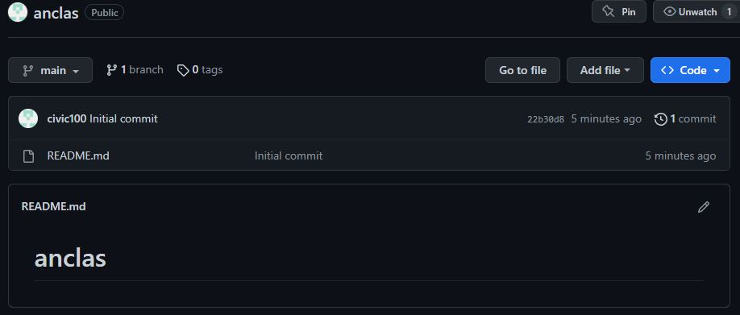
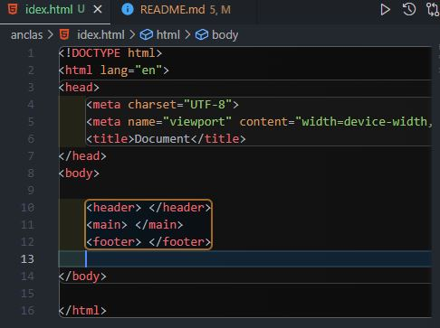
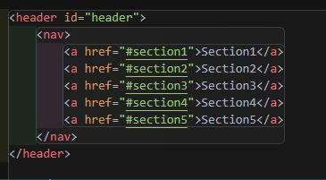
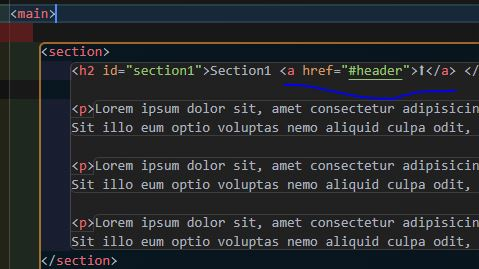

# anclas

### 1. Crear un repositorio GitHub

***
### 2. Crea las diferentes secciones de un HTML (header, main, footer...).

***
### 3. Utilizar NAV para escribir los enlaces del menú principal
### 4. Haz un menú de anclas que baje hasta cada title (utiliza ids para ello)

***
### 5. Finalmente haz que encabezado (titulo) vaya acompañado de un ⬆ que nos desplace arriba del todo de nuestra web

